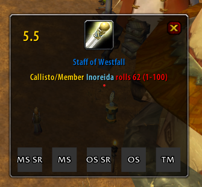

# Loot Blare 1.1.10

Loot Blare is a World of Warcraft addon originally designed **Turtle WoW**.

This addon displays a pop-up frame showing items and rolls when a single uncommon+ item is linked in Raid Warning. Rolls are automatically sorted by type to streamline the master looter's workflow.

### Features:

- **Start Rolling**: To start the rolling process, send the item as a **Raid Warning**. This will trigger the frame to appear and display rolls. The frame will appear only if the sender is the ML

- **Roll Sorting**: Rolls are automatically categorized and sorted by type to streamline loot distribution. Only the first roll submitted by each player is considered; subsequent rolls are ignored.

- **Show/Hide Frame**: To show or hide the frame, type:  
  `/lootblare` or `/lb`  
  If the frame is active, you can move it by dragging.

- **Easy Roll Buttons**: For raiders, the addon provides convenient roll buttons:

  - **SR (Soft Reserve)**: Rolls from 1 to 101.
  - **MS (Main Spec)**: Rolls from 1 to 100.
  - **OS (Off Spec)**: Rolls from 1 to 99.
  - **TM (Transmog)**: Rolls from 1 to 50.

- **Frame Duration**: By default, the frame stays on screen for `15 seconds` unless a new roll occurs. Adjust this duration with:  
  `/lootblare 'time <number>` or `/lb 'time <number>`

  Example: `/lootblare 'time 30` to set the duration to 30 seconds.

Every time the master looter changes, the new master looter announces the roll time defined. This value is also announced after updating the value with `/lb time <number>`. This announced value is applied to the entire raid to ensure consistency.

- **Auto-Close**: The frame closes automatically after the set time. Toggle this feature on or off with:  
  `/lootblare autoClose on/off` or `/lb autoClose on/off`

- **Configuration Commands**: For a full list of configuration options, type:  
  `/help`

- **Communication**: The addon uses the addon channel to update data about roll time and the current master looter. For example, if the player logs in after the ML has been set, he will automatically ask who the ML is and the ML will answer. Also, the ML will announce that he is the ML on add-on loading. All of this is invisible to the player

### The (moveable) frame in game:

Changelog:

- **1.1.10**: Prevent blare window from closing due to timeout for the Master Looter
- **1.1.9**: Add communication using CHAT_MSG_ADDON events
- **1.1.8**: Remove announce message after each roll. Added time announce message after changing master loot
- **1.1.7**: Added class colors, autoClose option, and config commands. Only show frame if the sender is the ML. Ignore rolls after the time has elapsed. Get FrameShowDuration from the ML.
- **1.1.6**: Simple Buttons and Tooltips.
- **1.1.5**: Added button for SR and roll type order and color.
- **1.1.4**: Added more buttons for OS and Tmog. Now only registers the first roll of each player.
- **1.1.3**: Added MainSpec Button for rolling.

___
Contributors:
* [Siventt](https://github.com/Siventt/LootBlare)
* [SeguisDumble](https://github.com/SeguisDumble)
* [Weird Vibes](MarcelineVQ/LootBlare)
